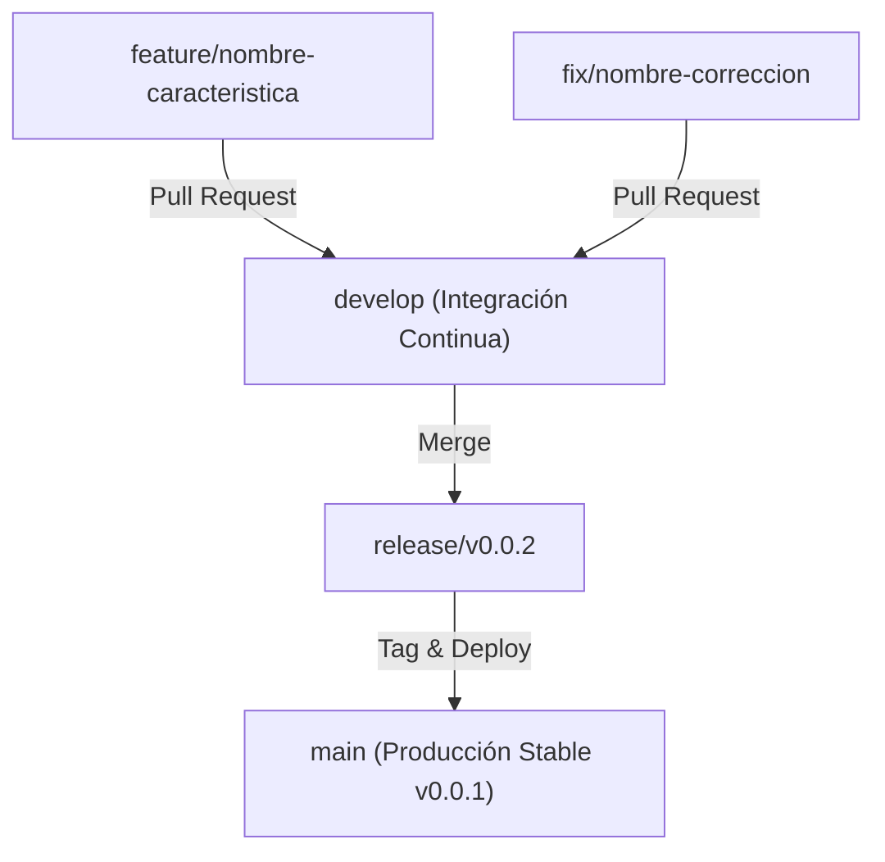

# Guía de Versionado y Flujo de Ramas (Git Branching Model)

Este documento establece las políticas de versionado semántico (**Semantic Versioning**) y el flujo de trabajo en GitHub para la plataforma **Proyecto MelaDos — Estudio Longitudinal de Impacto**.

---

## 🏷️ Versión Actual: `v0.0.1`

La versión actual del sistema es **`v0.0.1`** (Alpha de Producción), la cual comprende:
- Sistema de autenticación con simulador de roles SuperAdmin.
- Consola de campo offline PWA con sub-pruebas certificadas EGRA (7) y EGMA (6).
- Motor de búsqueda instantánea Meilisearch.
- Centro de gestión administrativa anti-duplicados de escuelas, evaluadores y cohorte.
- Cumplimiento normativo Ley 285 de Protección a la Niñez.

---

## 🌿 Estructura de Ramas en GitHub

### 1. Rama Principal (`main`)
- Contiene exclusivamente código verificado y listo para producción (`https://proninezpanama.app`).
- Cada merge a `main` requiere tag de versión semántica (ej. `git tag -a v0.0.1 -m "Release v0.0.1"`).
- Se sincroniza automáticamente con el webhook de despliegue en Coolify PaaS.

### 2. Rama de Desarrollo (`develop`)
- Rama de integración continua donde convergen las nuevas funcionalidades antes de preparar un release.

### 3. Ramas de Funcionalidades (`feature/*`)
- Creadas a partir de `develop`.
- Nombrado: `feature/nombre-descriptivo` (ej. `feature/exportacion-pdf-reportes`).

### 4. Ramas de Correcciones (`fix/*` o `hotfix/*`)
- Creadas para resolver errores específicos.
- Nombrado: `fix/corregir-sincronizacion-offline`.

---

## 🔄 Reglas para Pull Requests (PR)

1. **Revisión de Código**: Ningún commit directo a `main` por desarrolladores externos. Todo cambio debe realizarse mediante Pull Request.
2. **Pruebas de Compilación Pass**: Todo PR debe superar la suite de pruebas unitarias (`/api/admin/tests`) y `npm run build` sin errores de tipos.
3. **Actualización de Versión**: Si el PR incluye cambios significativos, se debe incrementar la constante `APP_VERSION` en `src/lib/version.ts` y `package.json`:
   - **PATCH** (`v0.0.X`): Correcciones de errores menores.
   - **MINOR** (`v0.X.0`): Nuevas funcionalidades compatibles.
   - **MAJOR** (`vX.0.0`): Cambios mayores o reestructuraciones.
